# Call of Orion --- Features

## Faction & Ship Selection

- Choose from 4 factions: **Earth**, **Colonial**, **Heavy World**, and **Ascended**
- Select from 5 ship types: Cruiser, Bastion, Aegis, Striker, Thunderbolt
- Ship previews and stat breakdowns shown on the selection screen
- Character selection with 3 unique characters (Debra, Ellie, Tara), each with 10 levels of progression
- Mouse and keyboard selection across all three phases

### Factions (selection-screen previews)

| Earth | Colonial | Heavy World | Ascended |
|:---:|:---:|:---:|:---:|
| 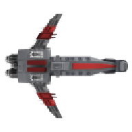 |  |  |  |

### Ship types (per faction)

The faction pick locks in the colour palette; the ship-type pick
chooses the stats. All five types are available under every faction.

|  | Cruiser | Bastion | Aegis | Striker | Thunderbolt |
|:---|:---:|:---:|:---:|:---:|:---:|
| **Earth**       |        | 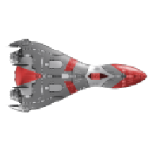       | 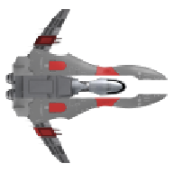       | 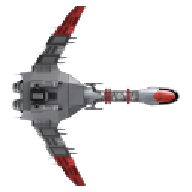       | 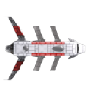       |
| **Colonial**    | 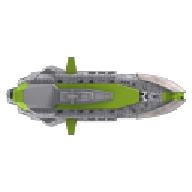    | 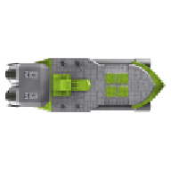    | 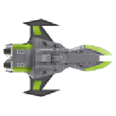    | 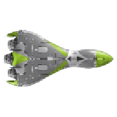    | 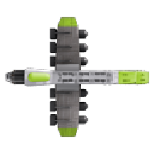    |
| **Heavy World** | 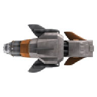 | 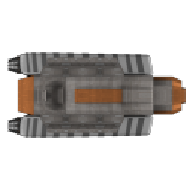 | 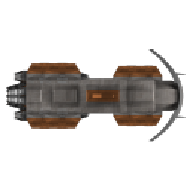 | 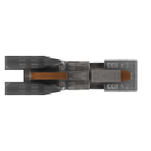 | 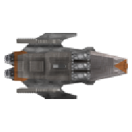 |
| **Ascended**    | 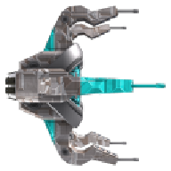    |     | 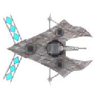    | 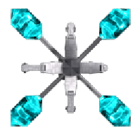    | 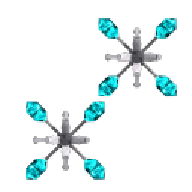    |

### Characters

| Debra | Ellie | Tara |
|:---:|:---:|:---:|
|  |  |  |

## Newtonian Flight Model

- Realistic thrust-based movement with inertia and space drag
- Per-ship physics: thrust, braking, rotation speed, max speed, and damping
- Coloured engine contrail particles unique to each ship type
- Seamless thruster engine sound loop while accelerating or braking
- **Sideslip**: Q slips left, E slips right (perpendicular to heading)
- Keyboard and Xbox 360 gamepad support

## Combat

- **Basic Laser** --- high-damage weapon for fighting enemies
- **Mining Beam** --- rapid-fire tool for harvesting asteroids
- Dual-gun ships fire from two laterally-offset hardpoints simultaneously
- Weapon cycling with Tab key or gamepad right bumper
- Camera shake and hit sparks on weapon impacts
- Shield system absorbs damage before HP; regenerates over time
- Animated energy shield bubble with hit-flash visual feedback
- Faction-specific shield colour tints

## Enemies --- Small Alien Ships

- 30 alien scout ships patrol the world with autonomous AI
- Two AI states: **Patrol** (lazy loops near spawn) and **Pursue** (orbit at standoff range and fire)
- Ranged aliens orbit the player at ~300 px instead of charging; each picks a random orbit direction
- Obstacle-avoidance steering around asteroids and other aliens
- Physics-based collision bouncing between all entities
- Destroyed aliens drop iron ore and may drop blueprints
- Alien ships respawn every 1 minute until count is restored

## Boss Encounter

- Spawns when player reaches max level, equips all 4 modules, has 5+ repair packs, and a Home Station
- Appears at the farthest world corner from the station and heads toward it
- Large dramatic announcement with pulsing text on spawn
- Boss HP bar at top of screen showing HP, shields, and current phase
- 3-phase AI with escalating difficulty: main cannon + spread, charge attack, enraged mode
- Boss projectiles damage both the player and station buildings
- Drops 200 iron and 500 XP on defeat; does not respawn once defeated
- Full save/load support; appears as a large red marker on the minimap

## Warp Zones

- 4 warp zone types: **Meteor**, **Lightning**, **Gas**, and **Enemy Spawner**
- Appear after the boss is defeated, providing access to Zone 2
- Red walls line the warp zone boundaries and drain shields on contact
- Bottom exit provides a safe return to Zone 1
- Top exit transitions the player into Zone 2 (The Nebula)

## Boss 2 --- Nebula Boss

- Triggered by building a **Quantum Wave Integrator** (QWI) in Zone 2 (cost: 1000 iron + 2000 copper)
- Larger sprite (3× the original boss); 3 randomised sprite rows in column 2 of the boss sheet
- Targets the player within 1000 px detection range
- **Gas-cloud cannon** --- launches drifting gas clouds at half cannon speed (275 px/s); each hit deals 30 damage and slows the player by 50 % for 1.5 s
- **Cone attack** --- 400 px-long, 200 px-wide cone (1.5 s active, 6 s cooldown) deals 20 damage per 0.5 s tick while the player is inside
- Routes around force walls instead of grinding on them; rams through asteroids and drops loot identical to standard alien kills along the way
- **Reward**: 3000 iron + 1000 copper (no XP)
- Click the QWI within 300 px to open the **QWI summon menu** to resummon (100 iron per summon) once the boss is defeated

## Zone 2 --- The Nebula

- New biome with a nebula-themed starfield background
- **Copper asteroids** --- new resource type, mineable with the Mining Beam
- **Double iron asteroids** --- tougher asteroids that yield twice the iron
- **Toxic gas clouds** --- environmental hazards that damage and slow the player on contact
- **Wandering magnetic asteroids** --- asteroids that drift through space and attract nearby ships; bounce off the player on contact with knockback physics
- 4 new alien types with unique abilities:
  - **Shielded Alien** --- comes with 50 shields for extra durability; orbits at range
  - **Fast Alien** --- moves at 160 px/s, harder to hit and outrun; flips orbit direction unpredictably
  - **Gunner Alien** --- equipped with 2 guns for double the firepower; orbits at range
  - **Rammer Alien** --- 100 HP + 50 shields, charges directly toward the player (no guns)

## Zone 3 --- The Star Maze

- 12000×12000 third biome reached through **post-Nebula-boss warp zones** (the same four themes as the Zone-1 warp zones, but with a 2× danger scalar)
- Hosts `STAR_MAZE_COUNT` (4) **dungeon-wall maze structures** laid out at the corners + centre via `STAR_MAZE_CENTERS`
- Each maze is a **5×5 room grid** (300 px room interior, 32 px wall thickness) carved with recursive-backtracking DFS for a unique, deterministic layout (seeded off the world seed)
- **MazeSpawner** in every room (100 HP + 100 shields) acts as a stationary turret; spawns a MazeAlien every 30 s up to a cap of 20 alive children. Killed spawners drop **1000 iron + 100 XP** and respawn after 90 s
- **MazeAlien** enemies use **A* pathfinding** through the maze's room-adjacency graph instead of bee-lining at the player; routes around walls without grinding on corners. 50 HP, 30 XP per kill
- **Outside the mazes** the zone is populated with the same Nebula content as Zone 2 (iron + copper + double-iron asteroids, gas clouds, wandering asteroids, Z2 aliens, null fields, slipspaces) via radius-aware reject filters that keep entities out of the maze rectangles
- Non-maze enemies that drift into a maze get pushed back out
- Misty Step **rejects teleports** whose path crosses a maze wall (samples every 16 px along the segment)
- Star Maze has its own corner wormholes that chain on to deeper `MAZE_WARP_*` warp variants

## Null Fields

- 30 stealth patches per non-warp zone (`NULL_FIELD_COUNT`) hide the player from enemies — while inside, AI targeting treats the player as invisible (`gv._player_cloaked` flag)
- Both Zone 2 alien classes and the Star Maze MazeAlien/MazeSpawner honour the cloak
- **Firing any weapon from inside** disables the field for 10 s (`NULL_FIELD_DISABLE_S`) and flashes it red; the field re-enables after the timer elapses
- Each field is a cluster of soft dots (`NULL_FIELD_DOT_COUNT = 28`) sized between 128 px and 256 px diameter
- Persisted in save/load and surfaced on the Station Info "Other Zones" panel

## Slipspaces

- 15 paired teleporter portals per non-warp zone (`SLIPSPACE_COUNT = 15`)
- Flying into a slipspace teleports the player to its paired exit and **conserves velocity** (the player exits with the same momentum they entered with)
- Display 160 px / collision 60 px (the player has to fly visually into the swirl, not just brush its outer edge)
- Rotates at 90 deg/s; minimap-marked
- Persisted in save/load

## Full-Screen Map (`M` key)

- Press `M` to open a full-screen zoomed-out map of the active zone
- Renders the player, fog of war, and all entity overlays (asteroids, aliens, buildings, parked ships, gas areas, null fields, slipspaces, wormholes, boss)
- Press `M` or ESC to close
- Cannot be opened while dead or while the escape menu is open

## Advanced Modules

- **Misty Step** --- double-tap WASD to teleport 100 px in that direction; costs 20 ability points
- **Force Wall** --- press G to deploy a 400 px shimmering barrier behind the ship; costs 30 ability points. Blocks enemy lasers and boss projectiles on contact; aliens steer around the wall and cannot cross it (any movement that would cut through the wall is reverted)
- **Death Blossom** --- press X to fire all homing missiles in a radial burst
- **Rear Turret** --- while the module is installed, holding fire auto-fires a broadside-class shot backward (opposite of heading) once every 0.5 s. 25 damage, 600 px/s, 400 px range. Crafts at the Advanced Crafter (200 iron)

## Homing Missiles

- Consumable ammunition with homing AI that tracks the nearest enemy
- Deals 50 damage per missile on impact
- Craftable at the Advanced Crafter

## Special Ability Meter

- Maximum capacity of 100 ability points
- Regenerates at 5 points per second
- Powers the advanced modules (Misty Step, Force Wall, Death Blossom)

## Mining & Resources

- 75 iron asteroids scattered across the world
- Mining Beam only --- Basic Laser has no effect on asteroids
- Asteroids spin, shake on hit, and explode with animated effects
- Iron pickups fly toward the player when nearby
- Asteroids respawn on a timer

## Inventory System

- 5x5 cargo hold grid toggled with I key or gamepad Y button
- Drag-and-drop with stacking, swapping, and world ejection
- **Right-click any cell to split a stack in half** (extras go to the cursor for placement)
- Iron and repair packs display with dedicated icons and count badges
- **Blueprint cells display a red dot overlay** until the recipe is unlocked at a crafter
- **Consolidate** button merges stacks (respects max stack limits)
- Ejected items despawn after 10 minutes

## Ship Module System

- 4 module slots displayed above the quick-use bar
- 12 module types: Armor Plate, Engine Booster, Shield Booster, Shield Enhancer, Damage Absorber, Broadside Module, Misty Step, Force Wall, Death Blossom, Missile Rack, Ability Capacitor, Hull Reinforcement
- Blueprint drops from aliens (50%) and asteroids (25%)
- Craft modules at the Basic Crafter after depositing blueprints
- Drag-to-equip with module slot management
- **Ship Stats panel** (C key, 380x520) shows stats with module modifications and all character benefits up to level 10
- **Character Bio panel** (360x520) alongside Ship Stats with random portrait and backstory

## Multi-Ship System

- **Ship upgrades via build menu** --- "Advanced Ship" enters placement mode with the next-level ship texture as a ghost; place near the station to upgrade
- **Old ship persists** --- the previous ship stays in the world as a `ParkedShip` with its own HP, shields, cargo, and module slots
- **Click to switch** --- fly near a parked ship and left-click to transfer control; inventory, modules, weapons, and ability meter all swap
- **Damage from any source** --- parked ships take damage from alien lasers, boss projectiles, and player weapons (friendly fire)
- **Destruction drops** --- destroyed ships drop cargo as iron/copper pickups and equipped modules as blueprint pickups
- **Minimap markers** --- parked ships shown as teal dots on the minimap
- **Hover tooltip** --- hovering a parked ship surfaces "Level N Ship (HP X/Y) — Click to board"
- **AI Pilot module** --- craft an `AI Pilot` at the Advanced Crafter (800 iron + 400 copper) and drag-install it onto any parked ship. As soon as the ship is unpiloted, it begins a counter-clockwise circular patrol at 90 % of the 400 px patrol radius around the Home Station. It engages enemies inside 600 px, firing a laser every 0.5 s into the turret-projectile list (so existing turret damage handling applies). If it fires at a target and no other enemies remain inside detect range, it flies straight back to the Home Station and resumes patrol once within 100 px of base
- **Zone-aware** --- parked ships stashed/restored during zone transitions and fully serialized in save/load

## Companion Drones

Two consumable drone variants stack 100-deep in the inventory and are
crafted at the Advanced Crafter (200 iron + 100 copper for 5 of
either). Press **R** to deploy the variant matching your active
weapon (Mining Beam → MiningDrone, Basic Laser → CombatDrone); press
**Shift+R** to recall the deployed drone and refund 1 charge. Only
one drone may be deployed at a time; pressing R with the *other*
weapon active swaps drones (refunds 1 of the old, consumes 1 of
the new).

### Stats and roles

- **MiningDrone** (75 HP, 0 shields, 20 dmg mining beam) — auto-mines
  asteroids in range and vacuums up iron / blueprint pickups within
  `MINING_DRONE_PICKUP_RADIUS` so loot ferries back to the player
  without manual flybys.
- **CombatDrone** (75 HP, 25 shields, 35 dmg laser, dashed-blue
  shield arc) — auto-engages enemies inside `DRONE_DETECT_RANGE`
  (600 px). **Maze spawners are priority targets** — killing one
  shuts off both its laser and its alien drip, so the drone always
  picks the nearest live spawner over an aggressively-firing alien
  parked next to it.

### Slot-based follow

Drones trail the player at one of three fixed 80 px slots relative
to the player's heading: **LEFT** (default, perpendicular-left),
**RIGHT** (perpendicular-right), and **BACK** (opposite forward).
The slot picker tries LEFT first, falls through to RIGHT then BACK
if the segment from player to slot is blocked by a maze wall.
Sticky preference keeps the drone from ping-ponging between LEFT
and RIGHT every frame in open space.

### Mode machine

Per-frame mode chosen by `_update_mode`:

- `FOLLOW` (default) — slot-based follow at 80 px from the player.
- `ATTACK` — enters when a target sits within `DRONE_DETECT_RANGE`
  (600 px) AND there is no maze wall on the line of sight.
- `RETURN_HOME` — enters when the player drifts past
  `DRONE_BREAK_OFF_DIST` (800 px); A*-paths back to the player
  through maze rooms while ignoring every enemy. Exits at <600 px
  (hysteresis).

A **stuck cooldown** (`_target_cooldown`) overrides everything —
when the drone abandons a target it can't reach behind a wall, it
freezes for 5 s before re-engaging. Surfaced as **"Stuck —
holding"** in the hover tooltip.

### Maze pathfinding (A* + safety nets)

Inside the Star Maze, drones use a shared `WaypointPlanner` over
the room-adjacency graph:

- **Doorway-aware steering** — emits the world-space midpoint of
  the carved doorway between the current and next room, not the
  next room's centre, so straight-line steering can't clip a wall
  corner.
- **Wall-band snap** — when the body's `find_room_index` returns
  None but it's within `_WALL_BAND_SLACK` (50 px) of a room AABB,
  the planner snaps the source to the nearest room. Catches drones
  partly clipped into the wall thickness.
- **Doorway arrival** — the path advances when the body is within
  `_DOORWAY_ARRIVAL_RADIUS` (24 px) of the current doorway, so the
  drone keeps moving instead of parking on the gap midpoint.
- **Maze entrance routing** — when the target sits outside every
  room, the planner heads for the **maze entrance room**, not the
  geographically-nearest room (which may be a sealed dead end).
  Once at the entrance the planner emits a fixed point past the
  gap (`entrance_xy_outer`) so the drone steps cleanly into open
  space rather than oscillating on the gap midpoint.
- **Symmetric entry** — body OUTSIDE the maze with target INSIDE
  → planner emits the entrance gap so the drone enters cleanly
  through the carved opening.
- **Un-stick nudge** — safety net for any remaining edge case.
  Tracks per-frame movement; if the drone hasn't moved more than
  10 px in 0.5 s while it should be steering, slides perpendicular
  to the steering vector for one frame to dislodge corner wedges.
  Direction alternates each fire.

### Fleet Control menu (`Y` key)

Modal overlay with four buttons:

- **RETURN** *(direct order)* — break off and A*-path back to
  the player. Auto-clears only when the drone is BOTH within
  160 px of the player AND has clear line of sight.
- **ATTACK** *(direct order)* — engage every detected enemy and
  ignore the 800 px break-off so the drone roams to fight.
- **FOLLOW ONLY** *(reaction)* — passive escort; never enters
  ATTACK even with targets in range.
- **ATTACK ONLY** *(reaction, default)* — original autonomy
  (engages targets in detect range, otherwise follows).

Direct orders override reactions until cleared; reactions persist
across deployments and are saved with the game.

### Friendly fire + line of sight

- Player projectiles **pass through AI-piloted parked ships** —
  no impact spark, no damage, projectile keeps travelling. Unmanned
  parked ships still take friendly fire so old hulls can be
  cleared deliberately.
- Drones **disengage when a maze wall blocks line of sight** to
  their target. A 7-sample segment test from drone to target
  catches wall geometry; on hit the drone returns to FOLLOW
  rather than grinding lasers into the wall.

### Map markers + hover tooltip

- **Minimap + full-screen map** — active drone is plotted as a
  small blue X (4 px arms). Drawn before the player chevron so
  the chevron stays on top when the two overlap. Honours fog of
  war — no marker on hidden tiles.
- **Hover tooltip (in-world or large map)** — shows
  `<Label>  HP <hp>/<max>  [Shield <s>/<max>]  <status>`. Status
  resolves to `Following`, `Hunting enemy`, `Returning to ship`,
  `Stuck — holding`, or `Stuck — no path`. Shield segment is
  omitted when `max_shields == 0` (mining drone).

### Save persistence

The deployed drone round-trips through saves: variant (mining vs
combat), position, HP, shields, current `_reaction`, and any
active `_direct_order` are all serialised into the save dict and
restored on load. The drone re-acquires targets on the first tick
post-load (targeting / cooldown state is intentionally not
persisted).

## Space Station Building System

- Build menu (B key) with iron cost from ship + station inventory
- 8 module types with unique stats, costs, and placement rules
- Edge-to-edge docking port snap system
- Deconstruction mode with iron refund
- Turrets auto-target nearest alien within range
- Missile Arrays auto-fire homing missiles at aliens within 600 px
- Repair Module heals player HP and boosts shield regen
- Building hover tooltip shows type and HP
- **Long-press LMB on a Turret or Missile Array** to drag-move it; clamped to within 300 px of the Home Station and overlap-checked against other buildings
- Base capacity of 4, expandable with Solar Arrays

## Station Inventory & Crafting

- 10x10 station grid accessible by clicking the Home Station
- Drag items between station and ship inventories
- Basic Crafter produces Repair Packs and ship modules
- Recipes unlock permanently when blueprints are deposited

## Trading Station

- Spawns when the player builds their first Repair Module
- Sell items for credits; buy consumables with credits
- Sell panel scrolls (with a visible scrollbar thumb) when the
  sellable-item list exceeds the visible rows
- Hold LMB on a sell row to tick off one unit every 0.15 s
- Shown on minimap as a bright yellow square

## Station Shield

- Placing a **Shield Generator** spawns a faction-tinted energy bubble
  centred on the Home Station
- **100 shield HP** (`STATION_SHIELD_HP`) absorbs alien lasers and boss
  projectiles before they reach any building
- Sized dynamically to cover every connected building — scales from
  the outermost building's edge + `STATION_SHIELD_PADDING` (80 px)
- Rendered as a **solid circle-outline border** (3 px, faction tint,
  alpha 200 idle / 255 on hit-flash) with a faint inner glow ring and
  a nearly-invisible interior fill — the bubble's inside stays
  readable while the perimeter remains clearly visible
- HP + max-HP persist through save/load; the sprite respawns on next
  tick once the Shield Generator still exists

## Story Encounter --- Double Star Refugee

- Building a **Shield Generator** in the Nebula zone triggers the arrival
  of **Scout Kael Vox** in his orange Double Star scout ship
- The ship enters from the right edge of the map, approaches the Home
  Station, and parks just outside the station's outermost building
  edge (station outer radius + 120 px) with no overlap
- Invulnerable --- no damage from enemies, player weapons, or collisions
- Hovering the mouse over the ship shows a **"Double Star Refugee"** label
- Click the ship within 320 px to open a **branching conversation tree**
  keyed off the active character:
  - **Debra** --- full five-scene arc uncovering the disappearance of
    her fiancé Ken Tamashii, with 3 major branches and nested follow-up
    choices that converge into a shared climax and a quest-activation
    aftermath (`find_ken`, `aliens_revealed`, `objective: Explore beyond
    the Nebula Zone`)
  - **Ellie** --- six-scene conspiracy thriller about the Kratos
    Corporation behind the Falling Star incident, the death of Dr.
    Marcus Chen, and the frozen-assets cover-up that turned her into a
    fugitive. Three major branches converge on an ending that activates
    the `ellie_quest_dismantle_kratos` quest and flips her status from
    fugitive to active operative
  - **Tara** --- five-scene archaeological thriller at her research
    station. Kratos operatives raided her science ship hunting for
    artifacts tied to an extinct civilisation the locals call "The
    Killers". Ending activates the `tara_quest_dead_zone` quest,
    flips her status to unauthorised expedition leader, and exposes
    the Kratos conspiracy to suppress The Killers research
- Number keys (1-4) or left-click pick a choice; SPACE/ENTER advances
  linear beats; ESC closes without committing quest flags
- Conversation state (met, quest flags, ship position) persists through
  save/load

## Quick Use Bar

- 10 slots (1--9, 0) for fast item access
- Assign by dragging from inventory; use by pressing number keys
- Rearrange by dragging between slots; unassign by dragging out

## Save/Load System

- 10 named save slots with full game state preservation
- Save slots display faction, ship type, character, HP, shields, module count
- Overwrite warning and delete support (DEL key)
- Quick-use, module slots, boss state, and fog of war all persist

## HUD & Mini-Map

- Left-side status panel with HP/shield bars, character video, active weapon, faction/ship info
- FPS counter (toggle with F), music track name with equalizer visualizer
- Mini-map showing full world: player (white), asteroids (grey), pickups (orange), aliens (red), buildings (cyan), parked ships (teal), trading station (yellow), boss (large pulsing yellow/red), gas areas (green octagonal outlines, proportional to world size), wormholes (purple), null fields (cyan), slipspaces (magenta), maze walls (grey rects, Star Maze only)
- Gas hazards in warp zones always visible on minimap regardless of fog of war
- **Station Info** (T key) --- building HP, module capacity, zone-specific entity counts, plus an "Other Zones" panel showing live stats from every inactive main zone (Double Star, Nebula, Star Maze)

## Fog of War

- World starts fully hidden; revealed as the player explores
- 800 px diameter reveal around the ship
- Grey fog overlay on mini-map; persists across save/load

## Character Video Player

- Looping 1:1 square character video portrait in the HUD
- GPU-side downscale via `glBlitFramebuffer` for high performance (~90 KB readback vs ~8 MB)
- Frame conversion throttled to 15 fps to maintain 50+ game FPS
- Choose character via **Video Properties** in the ESC menu
- Characters are video files (`Name.mp4`) in the `characters/` directory
- Video starts at a random position and loops seamlessly with a pre-built standby player

## Music Video Player

- Play video files in place of the background music soundtrack
- Video frame displayed as a small 16:9 panel in the HUD status panel, above the minimap
- **Supported formats**: MP4, AVI, WMV, M4V, 3GP, ASF, MKV, WebM, MOV, FLV, OGV
- **Requires FFmpeg** --- bundled DLLs in the project root (gitignored, ~220 MB)
- **Fullscreen or borderless mode required** --- Video button shows error in windowed mode
- **How to use**: ESC menu > Songs > Music Videos > configure a video directory, browse and select files
- Alternatively: ESC menu > Video to access the dedicated video file browser with scrollable list
- Click a video file to start playback (replaces background music); click **Stop Video** to stop
- Video loops automatically when it reaches the end
- Volume controlled by the Music volume slider
- Starting a video stops OST music and the equalizer visualizer
- Changing resolution preserves video playback state (video restarts automatically)
- Performance optimised: video frame cached and downscaled to 200 px wide; old GL textures removed from atlas to prevent VRAM accumulation
- `main.py` patches pyglet's clock to handle FFmpeg scheduling conflicts with Arcade

## Escape Menu

- Resume, Save/Load, Video Properties, Help, Songs, Main Menu
- Music/SFX volume sliders, resolution selector
- 10 save slots with naming overlay
- **Video Properties** --- resolution selector + character picker for the HUD video portrait
- **Songs** --- Stop Song, Other Song (random OST track), Music Videos (opens video browser)
- **Help** --- keyboard and gamepad controls display
- **Config** --- FPS toggle, Simulate All Zones toggle, volume sliders, video directory, autoplay OST toggle, Save Config

## Death & Respawn

- Dramatic destruction sequence with explosion and fire sparks (1.5 s death animation)
- **Auto-respawn** after the death animation — no Game Over screen in normal play
- **Drops** — every cargo stack, every equipped module (as blueprints), and every quick-use consumable lands at the death site as world pickups, scattered on a ring so they read individually instead of stacking into a single blob
- **Soft respawn** — if the player has visited a Home Station and one still stands, the ship reappears there with **50 % HP and 50 % shields**. Inventory, modules, level, XP are preserved
- **Hard reset** — if no Home Station exists anywhere (Zone 1, Zone 2, Star Maze), the player respawns as a fresh L1 ship at Zone 1 world centre with **25 % HP and 0 shields**. Ship type + faction are preserved; everything else (level, XP, ability meter, module slots) rolls back to first-game defaults
- **Bosses retreat** — both the Double Star and Nebula bosses flip to "patrol home" mode and fly back to the coordinates where they originally spawned. The flag clears the first frame the respawned player re-enters priority range, so re-engagement is automatic
- **Aliens forget the player** — every alien (across all zones, including stashed lists from inactive zones) reverts to PATROL state and picks a new patrol waypoint. If they detect the respawned ship, normal aggro runs through the standard state machine
- The "last visited station" is recorded whenever the player clicks a Home Station to open the station inventory

## Audio

- Shuffled background music playlist (auto-advances on track end)
- Per-weapon sound effects with rapid-fire throttling
- Engine thruster loop, collision bumps, explosions
- Global volume controls in Options and ESC menu

## Visual Effects

- Animated explosion sprite sheets (9 frames)
- Hit sparks, fire sparks, shield hit flash
- Engine contrail particles (ship-type coloured)
- Shield enhancer rotating yellow ring
- Boss charge attack telegraph (pulsing white/blue, red dash)
