# Call of Orion --- Game Statistics

## The Battlefield

| Property | Value |
|---|---|
| Zone 1 world size | 6,400 x 6,400 px |
| Nebula (Zone 2) world size | 9,600 x 9,600 px (+50 % per axis vs Zone 1 — 2.25× total area) |
| Star Maze (Zone 3) world size | 12,000 x 12,000 px (+25 % per axis vs Zone 2 — ≈ 5.6× Zone 1 area) |
| Default window resolution | 1,280 x 800 px |
| Resolution presets | 1280x800, 1366x768, 1600x900, 1920x1080, 2560x1440, 3840x2160 |
| Status panel width | 213 px (left side) |
| Background | Tiled seamless starfield (1,024 x 1,024 px tiles) |
| Player start position | World centre (3,200, 3,200) |

---

## Ship Types

All ships start at world centre. Ships rendered at 0.75x scale (96 px in-game). Collision radius: 28 px.

| Ship Type | HP | Shields | Shield Regen | Rotation | Thrust | Brake | Max Speed | Damping | Guns |
|---|---|---|---|---|---|---|---|---|---|
| **Cruiser** | 100 | 100 | 0.5 pt/s | 150 deg/s | 250 px/s^2 | 125 px/s^2 | 450 px/s | 0.98875x | 1 |
| **Bastion** | 150 | 50 | 0.5 pt/s | 150 deg/s | 200 px/s^2 | 125 px/s^2 | 450 px/s | 0.98875x | 1 |
| **Aegis** | 50 | 150 | 1.0 pt/s | 100 deg/s | 250 px/s^2 | 125 px/s^2 | 450 px/s | 0.98875x | 1 |
| **Striker** | 100 | 50 | 0.5 pt/s | 150 deg/s | 300 px/s^2 | 100 px/s^2 | 450 px/s | 0.983125x | 1 |
| **Thunderbolt** | 100 | 100 | 0.5 pt/s | 150 deg/s | 200 px/s^2 | 125 px/s^2 | 400 px/s | 0.98875x | 2 |

### Engine Contrail Colours

| Ship Type | Start Colour | End Colour |
|---|---|---|
| Cruiser | Blue (100, 180, 255) | Dark Blue (20, 40, 120) |
| Bastion | Orange (255, 200, 80) | Dark Orange (120, 60, 10) |
| Aegis | Green (80, 255, 180) | Dark Green (10, 80, 50) |
| Striker | Red (255, 100, 100) | Dark Red (120, 20, 20) |
| Thunderbolt | Purple (200, 120, 255) | Dark Purple (60, 20, 100) |

---

## Weapons

| Weapon | Damage | Cooldown | Speed | Range | Targets |
|---|---|---|---|---|---|
| **Basic Laser** | 25 | 0.30 s | 900 px/s | 1,200 px | Alien ships only |
| **Mining Beam** | 10 | 0.10 s | 500 px/s | 800 px | Asteroids only |

### Broadside Module

| Property | Value |
|---|---|
| Damage | 25 per projectile |
| Cooldown | 0.50 s |
| Speed | 600 px/s |
| Range | 400 px |
| Direction | Perpendicular to ship (both sides) |

---

## Ship Modules

| Icon | Module | Effect | Craft Cost |
|:---:|---|---|---|
|        | Armor Plate       | +20 max HP | 50 iron |
|     | Engine Booster    | +50 max speed | 75 iron |
|     | Shield Booster    | +20 max shields | 100 iron |
|    | Shield Enhancer   | +3 shield regen/s | 125 iron |
| 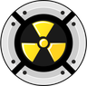   | Damage Absorber   | -3 damage to shields | 150 iron |
|          | Broadside Module  | Auto-fires perpendicular lasers | 200 iron |
|         | Misty Step        | Double-tap WASD to teleport 100 px | 400 iron + 200 copper |
|         | Force Wall        | Deploy 400 px barrier (G key); 20 s lifetime; blocks enemy projectiles + movement | 400 iron + 250 copper |
|      | Death Blossom     | Fire all missiles radially (X key) | 600 iron + 400 copper |
|        | Rear Turret       | Auto-fires a broadside-class shot backward every 0.5 s while holding fire | 200 iron |
|     | Homing Missiles   | Consumable; craft produces 20 missiles per batch | 50 iron + 25 copper |
|           | AI Pilot          | Install on a parked ship to make it autonomous; 400 px patrol, 600 px engage, returns to base after firing when no other enemies are in range | 800 iron + 400 copper |
|   | Adv. Crafter BP   | Blueprint only — unlocks building the Advanced Crafter | drop / trade |

- 4 module slots on the ship
- Only 1 of each type can be equipped
- Blueprints drop from aliens (50%) and asteroids (25%)

---

## Iron Asteroids

| Property | Value |
|---|---|
| Count | 75 |
| HP | 100 |
| Iron yield | 10 per asteroid |
| Collision radius | 26 px |
| Spin rate | 8--30 deg/s (random) |
| Respawn interval | 60 s |

---

## Small Alien Ships

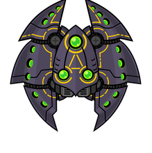

| Property | Value |
|---|---|
| Count | 30 |
| HP | 50 |
| Collision radius | 20 px |
| Movement speed | 120 px/s |
| Detection range | 500 px |
| Leash range | 1,500 px |
| Iron drop | 5 per kill |
| XP reward | 25 |
| Respawn interval | 60 s |

### Alien Combat AI

| Property | Value |
|---|---|
| Standoff distance | 300 px (ranged aliens orbit at this range) |
| Orbit behaviour | Approach if >360 px, back off if <210 px, strafe laterally otherwise |
| Orbit direction | Random per alien (clockwise or counter-clockwise) |

### Alien Weapon

| Property | Value |
|---|---|
| Damage | 10 per hit |
| Range | 500 px |
| Speed | 650 px/s |
| Cooldown | 1.5 s |

---

## Boss Encounter

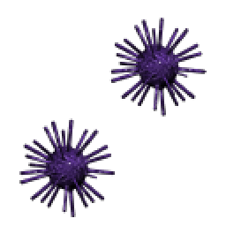

| Property | Value |
|---|---|
| HP | 2,000 |
| Shields | 500 |
| Collision radius | 38 px |
| Detection range | 800 px |
| Collision damage | 25 |
| Iron drop | 200 |
| XP reward | 500 |

### Boss Weapons

| Weapon | Damage | Cooldown | Speed | Range | Notes |
|---|---|---|---|---|---|
| Main Cannon | 40 | 1.0 s | 550 px/s | 700 px | Single projectile |
| Spread Shot | 15 x 3 | 3.0 s | 500 px/s | 600 px | 30-degree cone |
| Charge Attack | 60 | 8.0 s | 600 px/s | --- | 2s windup, 0.8s dash (Phase 2+) |

### Boss Phases

| Phase | HP Range | Speed | Shield Regen | Cooldown Modifier | Special |
|---|---|---|---|---|---|
| Phase 1 | 100%--50% | 180 px/s | 5/s | Normal | Main cannon + spread |
| Phase 2 | 50%--25% | 220 px/s | 10/s | Normal | Adds charge attack |
| Phase 3 | Below 25% | 220 px/s | 0/s | Halved | Enraged, no shield regen |

---

## Star Maze (Zone 3)

| Property | Value |
|---|---|
| Maze count per zone | 4 (`STAR_MAZE_COUNT`) |
| Layout positions | `STAR_MAZE_CENTERS` (corners + centre) |
| Rooms per maze | 5 × 5 = 25 |
| Room interior side | 300 px (`STAR_MAZE_ROOM_SIZE`) |
| Wall thickness | 32 px (`STAR_MAZE_WALL_THICK`) |
| Maze span (per maze) | 1,692 px on each side |
| Carve algorithm | Recursive-backtracking DFS, seeded off `_world_seed` |
| Pathfinding (MazeAlien) | A* over the room-adjacency graph derived from carved edges |

### Maze Spawner

| Property | Value |
|---|---|
| HP / Shields | 100 / 100 |
| Laser damage | 30 (`MAZE_SPAWNER_LASER_DAMAGE`) |
| Laser range / speed | 200 px / 300 px/s |
| Fire cooldown | 1.0 s (`MAZE_SPAWNER_FIRE_CD`) |
| Detection range | 300 px |
| Spawn cadence | 1 child every 30 s (`MAZE_SPAWNER_SPAWN_INTERVAL`) |
| Max alive children | 20 (`MAZE_SPAWNER_MAX_ALIVE`) |
| Iron drop / XP | 1000 / 100 |
| Respawn after kill | 90 s (`MAZE_SPAWNER_RESPAWN_INTERVAL`) |
| Collision radius | 40 px |

### Maze Alien

| Property | Value |
|---|---|
| HP | 50 |
| Speed | 120 px/s |
| Collision radius | 20 px |
| Laser damage | 10 |
| Laser range / speed | 200 px / 300 px/s |
| Fire cooldown | 1.5 s |
| Detection range | 300 px |
| Iron drop / XP | 10 / 30 |
| Pathfinding | A* across the room graph; per-frame moves rejected if they cross a wall |

---

## Nebula Boss

| Property | Value |
|---|---|
| Trigger | First Quantum Wave Integrator built in Zone 2 |
| Sprite | Boss sheet column 2, randomised across 8 rows |
| Sprite scale | 1.80x (`BOSS_SCALE`) — 3× larger than the original boss |
| Collision radius | 114 px (`BOSS_RADIUS`) |
| Detection range | 1000 px (prioritises the player over buildings) |
| Iron / Copper drop | 3000 / 1000 |
| XP reward | 0 (no XP) |

### Nebula Boss Weapons

| Weapon | Damage | Speed | Range | Cooldown | Notes |
|---|---|---|---|---|---|
| Cannon | 40 | 550 px/s | 800 px | 1.0 s | Same as Double Star |
| Gas Cloud | 30 | 275 px/s | 500 px | 4.0 s | 60 px collision radius; on hit applies a 1.5 s ×0.5 player-speed slow |
| Cone Attack | 20 / 0.5 s tick | --- | 400 px length × 200 px wide | 6.0 s | Cone stays active for 1.5 s; ticks while player is inside |

### Quantum Wave Integrator (QWI)

| Property | Value |
|---|---|
| Build cost | 1000 iron + 2000 copper |
| HP | 200 |
| Max count | 1 |
| Placement radius from Home Station | 300 px (`QWI_PLACE_RADIUS`) |
| Auto-spawn boss on build | Yes |
| Click-to-summon cost | 100 iron (`QWI_SPAWN_NEBULA_BOSS_IRON_COST`) |

---

## Null Fields

| Property | Value |
|---|---|
| Count per non-warp zone | 30 (`NULL_FIELD_COUNT`) |
| Diameter range | 128 – 256 px (`NULL_FIELD_SIZE_MIN/MAX`) |
| Disable timer after firing inside | 10 s (`NULL_FIELD_DISABLE_S`) |
| Visual cluster | 28 dots (`NULL_FIELD_DOT_COUNT`) |
| Effect | While inside, AI targeting treats the player as invisible (`gv._player_cloaked`) |
| Persistence | Saved + listed in T-menu "Other Zones" |

---

## Slipspaces

| Property | Value |
|---|---|
| Count per non-warp zone | 15 (`SLIPSPACE_COUNT`) |
| Display size | 160 px (`SLIPSPACE_DISPLAY_SIZE`) |
| Collision radius | 60 px (`SLIPSPACE_RADIUS`) — smaller than display so the player has to fly into the visual |
| Rotation speed | 90 deg/s |
| World-edge margin | 200 px |
| Behaviour | Paired teleport; conserves player velocity |
| Persistence | Saved + minimap-marked |

---

## Warp Zone Dimensions

| Property | Value |
|---|---|
| Zone size | 3,200 x 6,400 px |
| Variants | 3 each per theme (12 total): Zone-1 originals (`WARP_*`), Nebula post-boss (`NEBULA_WARP_*`, 2× danger scalar, top exit → Star Maze), Star-Maze (`MAZE_WARP_*`, return to Star Maze) |
| Entry | Bottom (from the originating zone) |
| Exit forward | Top (Zone 2 → Star Maze for `NEBULA_WARP_*`; back to home zone for the rest) |
| Safe return | Bottom exit back to originating zone |
| Red wall damage | Drains shields on contact |

---

## Zone 2 Asteroids

| Type | Count | HP | Yield | Notes |
|---|---|---|---|---|
| Iron Asteroid | 75 | 100 | 10 iron | Same as Zone 1 |
| Double Iron Asteroid | 15 | 200 | 20 iron | Tougher, double yield |
| Copper Asteroid | 75 | 100 | 10 copper | New resource type |

---

## Zone 2 Aliens

|  | Type | HP | Shields | Speed | XP Reward | Special |
|:---:|---|---|---|---|---|---|
| 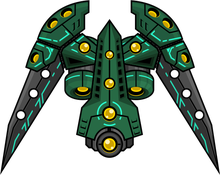 | Shielded Alien | 50 | 50 | 120 px/s | 50 | Extra shield durability; orbits at range |
| 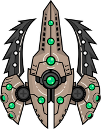         | Fast Alien     | 50 |  0 | 160 px/s | 60 | High speed; flips orbit direction unpredictably |
| 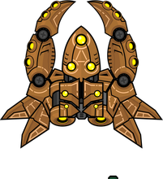     | Gunner Alien   | 50 |  0 | 120 px/s | 70 | 2 guns, double firepower; orbits at range |
| 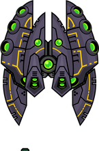     | Rammer Alien   | 100 | 50 | 120 px/s | 80 | Charges directly toward player (no guns) |

---

## Homing Missile Stats

| Property | Value |
|---|---|
| Damage | 50 |
| Tracking | Homing AI (nearest enemy) |
| Type | Consumable ammunition |
| Crafted at | Advanced Crafter |

---

## Special Ability Meter

| Property | Value |
|---|---|
| Maximum | 100 |
| Regen rate | 5 pts/s |
| Misty Step cost | 20 |
| Force Wall cost | 30 |
| Force Wall cooldown | 2 s |
| Force Wall length | 400 px |
| Force Wall lifetime | 20 s |
| Long-press-to-move threshold | 0.4 s (`MOVE_LONG_PRESS_TIME`) |

---

## AI Pilot Module

| Property | Value |
|---|---|
| Craft cost | 800 iron + 400 copper (Advanced Crafter) |
| Patrol radius (leash) | 400 px (`AI_PILOT_PATROL_RADIUS`) |
| Orbit radius | 360 px (90 % of leash; `AI_PILOT_ORBIT_RADIUS_RATIO`) |
| Detect / engage range | 600 px (`AI_PILOT_DETECT_RANGE`) |
| Movement speed | 140 px/s (`AI_PILOT_SPEED`) |
| Fire cooldown | 0.5 s (`AI_PILOT_FIRE_COOLDOWN`) |
| Laser damage | 10 (`AI_PILOT_LASER_DAMAGE`) |
| Laser speed | 650 px/s (`AI_PILOT_LASER_SPEED`) |
| Laser range | 700 px (`AI_PILOT_LASER_RANGE`) |
| "At base" threshold | 100 px (`AI_PILOT_HOME_ARRIVAL_DIST`) |
| Shield tint | `(255, 220, 80)` yellow (`ShieldSprite`, alpha 200) |
| Shield regen | 0.5× the ship type's base `shield_regen` |

---

## Station Shield

| Property | Value |
|---|---|
| Spawn trigger | First Shield Generator placed + Home Station present |
| HP | 100 (`STATION_SHIELD_HP`) |
| Radius formula | `station_outer_radius(home) + STATION_SHIELD_PADDING` |
| Padding | 80 px (`STATION_SHIELD_PADDING`) |
| Station outer radius | max building `hypot(dx,dy) + BUILDING_RADIUS` |
| Damage absorb | `collisions._station_shield_absorbs` (alien laser + boss projectile) |
| Interior alpha | 15 (`ShieldSprite` fill; nearly invisible) |
| Border | 3 px faction-tint `draw_circle_outline`, alpha 200 idle, 255 on hit-flash |
| Inner glow ring | 2 px ring 4 px inside border at 1/3 border alpha |
| Persistence | `station_shield_hp` + `station_shield_max_hp` serialised |

---

## Double Star Refugee (story NPC)

| Property | Value |
|---|---|
| Spawn trigger | First Shield Generator built while in Zone 2 |
| Approach speed | 140 px/s (`NPC_REFUGEE_APPROACH_SPEED`) |
| Parking spot | `(home.x + station_outer_radius + 120, home.y)` |
| Parking hold distance | 24 px |
| Player interact range | 320 px (`NPC_REFUGEE_INTERACT_DIST`) |
| Label | "Double Star Refugee" |
| Damage | None — NPC is invulnerable |
| Dialogue keys | 1-4 choose, SPACE/ENTER advance, ESC close |

---

## Station Buildings

|  | Type | HP | Iron Cost | Max Count | Capacity Slots | Notes |
|:---:|---|---|---|---|---|---|
|     | Home Station     | 100 | 100 | 1         | ---              | Root module; must be built first |
|   | Service Module   |  50 |  25 | 4         | 1                | General connector |
| 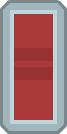  | Power Receiver   |  75 |  50 | unlimited | 1                | Links to solar arrays |
|    | Solar Array 1    |  50 |  75 | 2         | 1 (+6 capacity)  | |
|    | Solar Array 2    |  50 | 100 | 2         | 1 (+10 capacity) | |
| 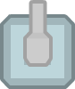        | Turret 1         | 100 |  50 | unlimited | 1                | Single-barrel auto-fire |
| 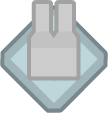        | Turret 2         | 100 |  75 | unlimited | 2                | Dual-barrel auto-fire |
|    | Repair Module    |  75 |  75 | 1         | 1                | Passive HP repair |
|    | Basic Crafter    |  75 | 150 | 1         | 1                | Crafts repair packs |

### Turret Stats

| Property | Value |
|---|---|
| Detection range | 400 px |
| Damage | 10 per shot |
| Cooldown | 1.5 s |
| Projectile speed | 700 px/s |
| Projectile range | 500 px |

### Repair Module Stats

| Property | Value |
|---|---|
| Repair range | 300 px from Home Station |
| Repair rate | 1 HP/s (player + buildings) |
| Shield regen boost | +1 pt/s |

### Crafting

| Recipe | Iron Cost | Time | Output |
|---|---|---|---|
| Repair Pack | 200 | 60 s | 5 packs |

---

## New Buildings (Zone 2)

|  | Type | HP | Iron Cost | Copper Cost | Max Count | Notes |
|:---:|---|---|---|---|---|---|
|           | Advanced Crafter         | 150 | 1000 | 500  | unlimited | Crafts advanced modules and missiles (blueprint-gated) |
| 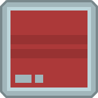         | Fission Generator        | 200 | 1000 | 500  | 2         | +12 module capacity; Zone-2 power source |
|           | Shield Generator         | 150 |  800 | 400  | 1         | Spawns the station energy-shield bubble |
|              | Missile Array            | 150 |  600 | 300  | unlimited | Auto-fires homing missiles at aliens within 600 px |
|                 | Basic Ship (placement)   | 100 |  500 | 250  | unlimited | Places a level-1 `ParkedShip`; only while no other L1 exists |
|              | Advanced Ship (upgrade)  | 100 | 1000 | 500  | unlimited | Upgrade placement — new level-2 ship at cursor; old ship persists as parked |
| 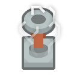   | Quantum Wave Integrator  | 200 | 1000 | 2000 | 1         | Auto-spawns the Nebula boss on build; clicking opens the Nebula-boss summon menu (100 iron per resummon) |

---

## Trading Station

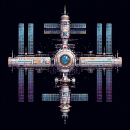

Spawns the first time the player builds a **Repair Module**. Renders
in-world at 0.15× scale; click within interaction range to open the
trade panel.

| Item | Sell Price | Buy Price |
|---|---|---|
| Iron | 1 credit | --- |
| Repair Pack | 100 credits | 400 credits (x5) |
| Blueprint | Half craft cost | --- |
| Module | Full craft cost | --- |

---

## Fog of War

| Property | Value |
|---|---|
| Reveal radius | 400 px (800 px diameter) |
| Grid cell size | 50 px |
| Grid dimensions | 128 x 128 cells |
| Persistence | Saved/loaded with game state |

---

## Music Video Player

| Property | Value |
|---|---|
| Supported formats | MP4, AVI, WMV, M4V, 3GP, ASF, MKV, WebM, MOV, FLV, OGV |
| Decoder | FFmpeg (bundled DLLs in project root, ~220 MB, gitignored) |
| Display location | HUD status panel, above minimap, 16:9 aspect ratio |
| Availability | Fullscreen or borderless mode only |
| Frame downscale | 200 px wide (GPU blit + PIL conversion) |
| Conversion rate | ~24--30 new frames/s from video source |
| Required DLLs | avcodec-62, avformat-62, avutil-60, swresample-6, swscale-9, avfilter-11, avdevice-62 |

---

## Character Video Player

| Property | Value |
|---|---|
| Display location | HUD status panel, 1:1 square aspect |
| Downscale method | GPU-side `glBlitFramebuffer` (1440 to 200 px) |
| Readback size | ~90 KB per frame (vs ~8 MB unscaled) |
| Conversion rate | 15 fps (throttled) |
| Loop method | Pre-built standby player loaded 5s before end-of-file |
| Source directory | `characters/` (scanned for `Name.mp4` files) |

---

## Character Progression

- XP thresholds: 0, 100, 300, 600, 1000, 2500, 3600, 4700, 5800, 7000
- XP hard-capped at 7,000 (max level 10)
- XP earned: 10 per asteroid, 25 per alien kill, 500 for boss defeat

---

## Persistent Configuration

Settings stored in `config.json` (gitignored):

| Setting | Description | Default |
|---|---|---|
| `music_volume` | Music volume | 0.35 |
| `sfx_volume` | Sound effects volume | 0.60 |
| `video_dir` | Video file directory path | (empty) |
| `show_fps` | FPS counter visibility | false |
| `autoplay_ost` | Auto-play OST on game start | true |
| `simulate_all_zones` | Tick inactive zones in background | false |

---

## Parked Ship Stats

Parked ships inherit HP and shields from `SHIP_TYPES[ship_type]` + level bonuses (`SHIP_LEVEL_HP_BONUS = 25`, `SHIP_LEVEL_SHIELD_BONUS = 25` per level above 1). Shields absorb damage first, overflow hits HP. On destruction, all cargo drops as pickups and equipped modules drop as blueprint pickups.

| Attribute | Source |
|---|---|
| HP | `SHIP_TYPES[ship_type]["hp"] + (level - 1) * 25` |
| Shields | `SHIP_TYPES[ship_type]["shields"] + (level - 1) * 25` |
| Switch range | 300 px (same as `STATION_INFO_RANGE`) |
| Click radius | 40 px |
| Minimap marker | Teal dot, size 6 |

---

## Item Stack Limits

| Item | Max Stack |
|---|---|
| Iron | 999 |
| Copper | 999 |
| Repair Pack | 99 |
| Missile | 500 |
| Blueprints/Modules | 10 |
